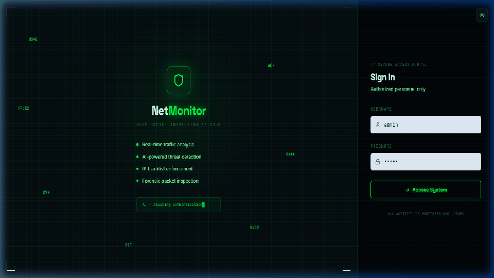
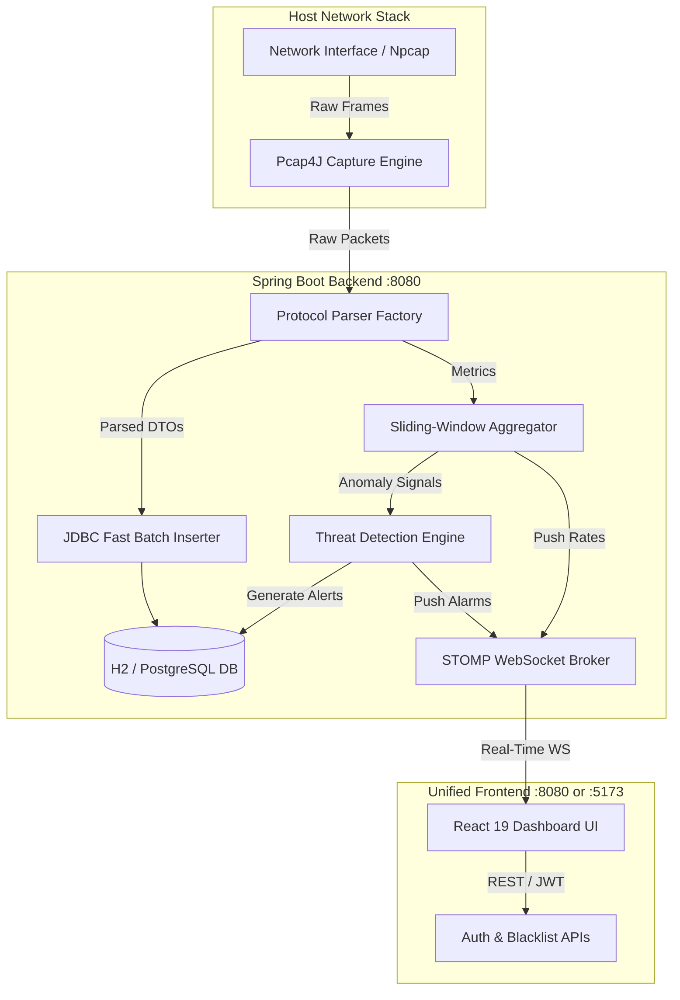
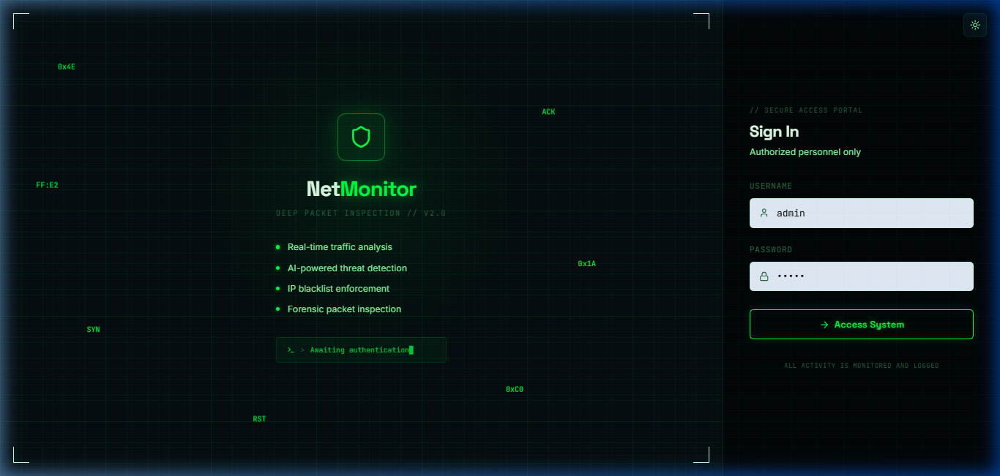
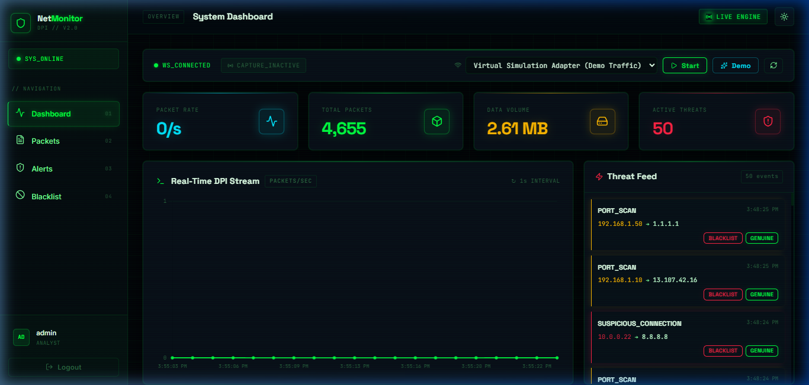
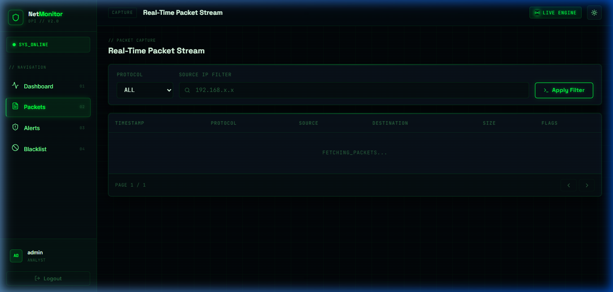
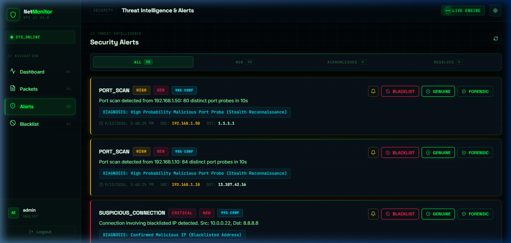
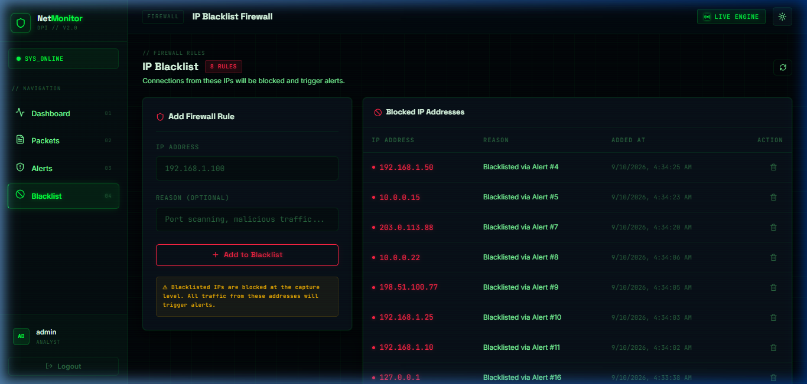

# NetMonitor — Deep Packet Inspection & Threat Detection System

<div align="center">

[](https://github.com/Vinaypatel24/network-traffic-monitoring-system/actions)


[](https://github.com/Vinaypatel24/network-traffic-monitoring-system/stargazers)
[](LICENSE)

<br/>


<br/>

**A high-performance full-stack network monitoring, packet dissection, and real-time threat detection engine with an interactive cybersecurity-themed HUD dashboard.**

[**Read the Complete User Guide (Step-by-Step Manual) →**](USER_GUIDE.md)

</div>

---

## 🎬 Interactive System Walkthrough

<div align="center">
  
  <p><em>Autonomous walkthrough showcasing secure authentication, real-time packet capture, traffic analytics, deep packet inspection, and threat response.</em></p>
</div>

---

## ⚡ Key Features

- 🛰️ **Live Packet Capture & Dissection**: Real-time packet capture via `pcap4j` on physical network interfaces (Wi-Fi, Ethernet) or the built-in virtual simulation adapter.
- 🔬 **Deep Layer 3 & Layer 4 Inspection**: Parses headers and payloads for TCP (with TCP flag tracking), UDP, ICMP, and DNS protocols.
- 🛡️ **Autonomous Threat Detection Engine**:
  - **Port Scan Detection**: Detects reconnaissance when a source probes $>50$ distinct ports within a 10s sliding window.
  - **Traffic Spike Detection**: Alerts when traffic surges $>500\%$ over rolling baseline volume.
  - **Abnormal Rate Detection**: Flags sustained high packet flooding ($>1,000$ p/s).
  - **Suspicious Connection Heuristics**: Identifies abnormal TCP flag states (`NULL`, `XMAS`, unsolicited `SYN-ACK`).
- ⚡ **Real-Time WebSocket Feed**: Sub-second streaming of packet statistics and alarms directly to the UI using STOMP over WebSockets.
- 🛑 **Interactive IP Firewall & Blacklisting**: 1-click ban actions directly from security alerts and manual firewall rule management.
- 💾 **Plug-and-Play Persistent Storage**: Runs out of the box with zero external DB dependencies using disk-persisted H2, or scales to production PostgreSQL via Docker.
- 🎨 **Cybersecurity / Threat-Hunter Dark HUD**: Built with React 19, Chart.js, Lucide Icons, CRT scanline overlay, neon status indicators, and responsive monospace terminal telemetry.

---

## 🏛️ System Architecture



---

> ### 🆕 First Time Here? Start with the Setup Guide!
>
> **If you're new and want to run this project on your computer**, we have a detailed step-by-step guide that covers _everything_ — from installing Git, Java, and Node.js to cloning and launching the app.
>
> ### 👉 **[Read the Complete Setup Guide (SETUP_GUIDE.md)](SETUP_GUIDE.md)** 👈

---

## 🚀 Quick Launch (Windows Single-Click)

The repository includes a single-click launcher that initializes the database, backend engine, and unified UI without requiring complex setups:

1. Right-click **`start.bat`** and select **Run as Administrator** *(Administrator rights are required by Windows for raw Npcap packet capture)*.
2. The launcher will automatically start the unified application on port 8080 and open your browser:
   - **Dashboard**: `http://localhost:8080`
   - **H2 DB Console**: `http://localhost:8080/h2-console`

### Default Login Credentials

| Attribute | Value |
| :--- | :--- |
| **Username** | `admin` |
| **Password** | `Admin@123` |

---

## 🖼️ Application Gallery

| Authentication Terminal | Main Threat Dashboard HUD |
| :---: | :---: |
|  |  |
| **Live Packet Inspector & Dissection** | **Threat Intelligence & Alerts** |
|  |  |
| **Active Firewall & IP Blacklist** | |
|  | |

---

## 🗄️ Database Console Access

NetMonitor dev profile uses an embedded, disk-persisted H2 database that matches PostgreSQL syntax.

- **Console URL**: `http://localhost:8080/h2-console`
- **Driver Class**: `org.h2.Driver`
- **JDBC URL**: `jdbc:h2:file:./data/netmonitor;DB_CLOSE_DELAY=-1;MODE=PostgreSQL;NON_KEYWORDS=VALUE`
- **Username**: `sa`
- **Password**: *(Leave blank)*

---

## 💻 Manual Setup & Development

### Prerequisites
- **Java 21**
- **Node.js 20+**
- **Npcap** (Required for native Windows packet sniffing: [Download Npcap](https://npcap.com/))
- **Docker** (Optional, for containerized PostgreSQL or Linux deployment)

### 1. Backend Service
```bash
cd network-monitor-backend
mvn spring-boot:run -Dspring-boot.run.profiles=dev
```

### 2. Frontend Development Server (Hot-Reload)
```bash
cd network-monitor-frontend
npm install
npm run dev
```
Navigate to `http://localhost:5173`. Requests to `/api` and `/ws` are automatically proxied to port 8080.

### 3. Docker Deployment (Linux Host Network Mode)
```bash
docker-compose up --build -d
```

---

## 📖 Detailed Documentation

- 📘 [**User Guide & Operator Manual**](USER_GUIDE.md): Detailed walkthrough for all views, features, and troubleshooting tips.
- 🗺️ [**Project Roadmap**](PROJECT_ROADMAP.md): Architectural sprints and completed milestones.
- 📊 [**Project Progress & Verification Log**](PROJECT_PROGRESS.md): Feature status and test logs.
- 📐 [**System Blueprint**](Network-Traffic-Monitoring-System-Blueprint.md): Full technical specification.

---

## 🤝 Contributing & Community

Contributions make the open-source community an amazing place to learn, inspire, and build. Any contributions you make are **greatly appreciated**!

- 🍴 Want to build new features or experiment with network forensics? Feel free to **[Fork this Repository](https://github.com/Vinaypatel24/network-traffic-monitoring-system/fork)**!
- 📖 Read the **[Contributing Guidelines](CONTRIBUTING.md)** for local setup, architecture tips, and beginner-friendly feature ideas.

---

## ⭐ Show Your Support

If you find **NetMonitor** useful or interesting, please consider giving it a **Star ⭐** and **Forking 🍴** it! Your support helps others discover this project.

<div align="center">

[](https://github.com/Vinaypatel24/network-traffic-monitoring-system/stargazers)
&nbsp;
[](https://github.com/Vinaypatel24/network-traffic-monitoring-system/fork)

</div>

---

## 📄 License

This project is licensed under the MIT License — see the [LICENSE](LICENSE) file for details.
