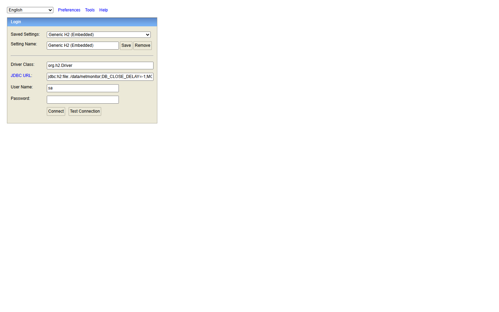

# NetMonitor - User Guide & Operator Manual

Comprehensive operational manual for the **NetMonitor Deep Packet Inspection (DPI) & Threat Detection System**.

---

## Table of Contents
1. [Overview](#1-overview)
2. [Quick Launch (Single-Click)](#2-quick-launch-single-click)
3. [Default Credentials](#3-default-credentials)
4. [User Interface Walkthrough](#4-user-interface-walkthrough)
   - [4.1 Authentication & Login](#41-authentication--login)
   - [4.2 System Dashboard & DPI Stream](#42-system-dashboard--dpi-stream)
   - [4.3 Real-Time Packet Stream & Filter](#43-real-time-packet-stream--filter)
   - [4.4 Threat Intelligence & Security Alerts](#44-threat-intelligence--security-alerts)
   - [4.5 IP Blacklist Firewall Management](#45-ip-blacklist-firewall-management)
   - [4.6 H2 Database Console](#46-h2-database-console)
5. [Threat Detection Engine Capabilities](#5-threat-detection-engine-capabilities)
6. [Simulating Test Traffic](#6-simulating-test-traffic)
7. [Troubleshooting & FAQs](#7-troubleshooting--faqs)

---

## 1. Overview

NetMonitor is a full-stack network traffic analysis and intrusion detection platform. It captures raw Layer 3/4 network packets, dissects protocol headers, computes real-time sliding-window traffic metrics, flags suspicious behavioral patterns (such as stealth port scans and volume spikes), and provides an interactive firewall blacklist control center.

---

## 2. Quick Launch (Single-Click)

On Windows systems, the entire platform runs out of the box with zero external database installation required:

1. Double-click **`start.bat`** in the project root directory (run as Administrator for native packet capture).
2. The launcher will automatically:
   - Initialize the Spring Boot engine with the embedded persistent H2 database.
   - Serve the optimized React single-page dashboard on **Port 8080**.
   - Open your default browser to **`http://localhost:8080`**.

> **Developer Mode:** If you wish to run the hot-reloading Vite dev server for frontend development:
> ```bash
> cd network-monitor-frontend
> npm run dev
> ```
> Frontend dev URL: `http://localhost:5173` (proxies `/api` and `/ws` to port 8080).

---

## 3. Default Credentials

The system comes pre-seeded with an administrator account:

| Role | Username | Password |
| :--- | :--- | :--- |
| **System Administrator** | `admin` | `Admin@123` |

---

## 4. User Interface Walkthrough

### 4.1 Authentication & Login
Navigate to `http://localhost:8080/login`. The login interface uses stateless JWT tokens stored in secure `httpOnly` cookies and local state.


- Enter `admin` / `Admin@123` and click **Sign In**.
- If tokens expire, the system automatically uses refresh tokens or prompts for re-authentication.

---

### 4.2 System Dashboard & DPI Stream
Once logged in, you will be directed to the main **System Dashboard**.


**Key Components:**
- **Status Indicator**: Confirms `Live Stream Active` and `Live Engine Active` via WebSocket STOMP feed.
- **Top Metric Cards**:
  - **Packet Rate**: Live throughput in packets per second (p/s).
  - **Total Packets**: Cumulative packet count captured in the session.
  - **Data Volume**: Megabytes/Gigabytes captured and processed.
  - **Active Threats**: Unresolved security threats flagged by the detection engine.
- **Adapter Selector**: Select physical NICs (Wi-Fi, Ethernet) or the built-in **Virtual Simulation Adapter** for safe lab demonstrations.
- **Real-Time DPI Stream Chart**: Dynamic line chart updating every second with sliding-window packet volumes.
- **Live Threat Feed**: Real-time event log of detected intrusions with 1-click **Blacklist** and **Genuine** (mark resolved) action buttons.

---

### 4.3 Real-Time Packet Stream & Filter
Click **Packets** on the sidebar to view incoming Layer 3/4 traffic.


**Features:**
- **Protocol Filter**: Filter packets by `TCP`, `UDP`, `ICMP`, or `DNS`.
- **Source IP Search**: Search traffic emanating from specific hosts or subnets.
- **Packet Details Grid**:
  - **Time**: High-precision timestamp.
  - **Protocol**: Distinct protocol badge.
  - **Source & Destination**: Host IPs and communication ports.
  - **Size**: Packet payload size in bytes.
  - **Flags**: TCP flags (e.g., `ACK`, `FIN`, `PSH`, `SYN`).

---

### 4.4 Threat Intelligence & Security Alerts
Click **Alerts** on the sidebar to access the threat triage center.


**Features:**
- **Threat Card Information**: Displays threat category, severity level (`CRITICAL`, `HIGH`, `MEDIUM`), timestamp, source IP, target IP, and confidence rating.
- **Diagnostic Explanations**: Clarifies the heuristic reason (e.g. `Diagnosis: High Probability Malicious Port Probe (Stealth Reconnaissance)`).
- **Incident Response Actions**:
  - **Blacklist**: Instantly pushes the offender's IP address to the firewall blacklist table.
  - **Genuine**: Marks the alert as reviewed and resolved false-positive.
  - **Analyze**: Opens detailed connection history for forensic inspection.

---

### 4.5 IP Blacklist Firewall Management
Click **Blacklist** on the sidebar to view active firewall blocking rules.


**Features:**
- **Add New Rule**: Manually input any external or internal IP address with an optional reason note.
- **Rule Table**: Displays blocked IP addresses, reason (e.g., `Blacklisted via Alert #14`), creation timestamp, and a trash icon to revoke the ban.

---

### 4.6 H2 Database Console
The system stores user credentials, session history, statistical rollups, security alerts, and firewall rules in an embedded disk database.

- Console URL: **`http://localhost:8080/h2-console`**



**Connection Parameters:**
- **Driver Class**: `org.h2.Driver`
- **JDBC URL**: `jdbc:h2:file:./data/netmonitor;DB_CLOSE_DELAY=-1;MODE=PostgreSQL;NON_KEYWORDS=VALUE`
- **User Name**: `sa`
- **Password**: *(Leave blank)*

Click **Connect** to query tables (`USERS`, `ROLES`, `ALERTS`, `BLACKLISTED_IPS`, `CAPTURE_SESSIONS`, `TRAFFIC_STATISTICS`).

---

## 5. Threat Detection Engine Capabilities

NetMonitor runs a multi-heuristic sliding-window detection pipeline:

1. **Port Scan Detection**: Detects reconnaissance attacks when a single source IP touches $> 50$ distinct ports within a 10-second sliding window.
2. **Traffic Spike Detection**: Detects volume surges exceeding $500\%$ of the rolling 60-second baseline.
3. **Abnormal Rate Detection**: Flags anomalies when a host exceeds sustained packet thresholds (e.g., $> 1,000$ packets/second).
4. **Suspicious Connection Heuristics**: Detects abnormal TCP flag combinations (e.g., `NULL` scans, `XMAS` scans, or unsolicited `SYN-ACK`).

---

## 6. Simulating Test Traffic

To safely test the alert engine without risking physical network disruption:
1. In the Dashboard header, select **Virtual Simulation Adapter (Demo Traffic)**.
2. Click the **Demo Traffic** button.
3. Observe live packets populate in the **Packets** tab, graph spikes in the **Real-Time Traffic** chart, and simulated port scan alarms appear in the **Live Threat Feed**.

---

## 7. Troubleshooting & FAQs

### Why does packet capture fail on Windows physical interfaces?
Packet capture on Windows requires the **Npcap** or **WinPcap** driver and Administrator privileges:
- Download and install [Npcap for Windows](https://npcap.com/) (ensure *"Install Npcap in WinPcap API-compatible Mode"* is checked).
- Right-click `start.bat` and select **Run as Administrator**.
- If Npcap is absent, you can still use the **Virtual Simulation Adapter** and test all UI, authentication, database, and alert workflows.

### How do I reset the database?
The database files are stored in `network-monitor-backend/data/netmonitor.mv.db`.
1. Stop the backend.
2. Delete the `network-monitor-backend/data/` folder.
3. Restart via `start.bat`. Flyway migrations will automatically re-create the schema and seed the default `admin` user.
